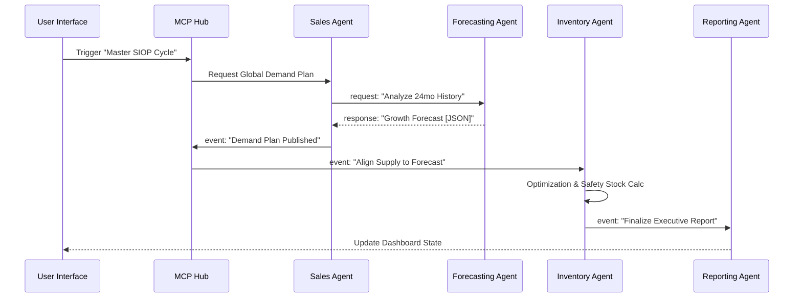

# S&OP Multi-Agent System: Architecture for Developers

This directory contains the architectural blueprints and design patterns used to build the **S&OP Multi-Agent Orchestration Platform**. This project serves as a reference implementation for developers building complex, collaborative AI systems using the **Model Context Protocol (MCP)** and **Antigravity**.

---

## 🏗️ System Overview

The system is built on a **Hub-and-Spoke** architecture, where a central "MCP Hub" orchestrates communication between specialized AI agents. This design ensures that agents remain decoupled, specialized, and capable of executing long-running business processes like Sales & Operations Planning.

### Key Components

1.  **MCP Hub (`/mcp-hub`)**: The "Brain" of the communication layer.
    *   **Registry**: Tracks active agents and their capabilities.
    *   **Message Router**: Facilitates `request`, `response`, and `event` message types.
    *   **Event Bus**: Broadcasts system-wide state changes (e.g., "Forecast Ready").
2.  **Specialized Agents (`/agents`)**:
    *   **Parent Agents**: Coordinate high-level domains (e.g., Sales Agent, Inventory Agent).
    *   **Sub-Agents**: Perform atomic statistical or optimization tasks (e.g., Demand Forecasting, EOQ Calculation).
3.  **Visualization UI (`/ui`)**:
    *   A React-based dashboard that provides real-time visibility into the agent's thought processes and data flows.

---

## 🗺️ Orchestration Flow

Below is the sequence for a **Master S&OP Cycle**, illustrating how data flows from market demand to supply chain alignment.

---

## 🛠️ Developer Patterns & Tips

### 1. Message-Driven Autonomy
Instead of direct function calls, agents use **asynchronous events**. This allows the Sales Agent to "publish" a forecast without needing to know who consumes it. The Inventory Agent simply "subscribes" to forecast events.

### 2. Standardized Payloads
Every message includes a `payload` field containing structured JSON. This ensures that the **Reporting Agent** can consume data from any part of the system and generate a unified dashboard.

### 3. Leveraging Antigravity
When building with Antigravity, follow these best practices:
*   **Separation of Concerns**: Keep agent logic in the `/agents` directory and orchestration logic in `/mcp-hub`.
*   **Recursive Refinement**: Use sub-agents for heavy computation (like statistical forecasting) so the parent agent can focus on "strategy" and "coordination".
*   **Visual Debugging**: Ensure your agent states (`idle`, `processing`, `error`) are reflected in the UI to make the distributed system easier to debug.

---

## 🚀 Getting Started for Contributors

1.  **Explore the Schema**: Check `SIOP_MULTI_AGENT_SYSTEM_README.md` for the database and message structure.
2.  **Run the Demo**: Use `docker-compose up` to see the full flow in action.
3.  **Extend**: Add a new sub-agent to the `Operations Agent` to handle logistics or transport planning!

---
> [!TIP]
> This architecture is designed to be **Agentic Native**. It assumes the agents are not just "chatbots" but active participants in a state-managed business workflow.
