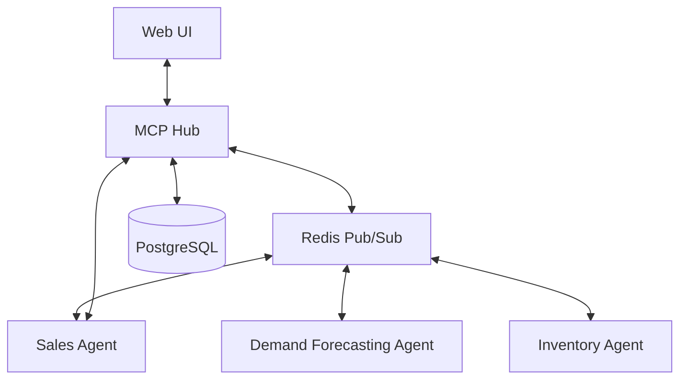

[← Back to Project Overview](../README.md)

# Architecture Overview

The S&OP Agent Orchestrator is a distributed system designed for multi-agent coordination in supply chain planning.

## System Components

### 1. MCP Hub
- **Role**: Central communication and coordination service.
- **Technology**: Node.js, Express, Socket.io.
- **Responsibilities**: Agent registration, message routing, WebSocket management for real-time UI updates, and system test execution.

### 2. Agents
- **Role**: Autonomous functional units performing specific tasks.
- **Types**: 
  - **Parent Agents**: High-level coordinators (e.g., Sales Agent, Inventory Agent).
  - **Sub-agents**: Specialized task performers (e.g., Demand Forecasting, Inventory Optimization).
  - **Reporting Agents**: Data consolidators.
- **Technology**: Multi-Model Context Protocol (MCP) compatible servers.

### 3. Messaging Layer
- **Role**: Asynchronous communication between the Hub and Agents.
- **Technology**: Redis (Pub/Sub).
- **Function**: Agents subscribe to their specific channels; the Hub publishes messages to route them.

### 4. Persistence Layer
- **Role**: Persistent storage of system state.
- **Technology**: PostgreSQL.
- **Data Model**: Stores agent registry, capabilities, and message history.

### 5. Web UI
- **Role**: User dashboard for monitoring and control.
- **Technology**: React (Vite), Material UI.
- **Features**: Scenario launcher, real-time message flow visualization (Canvas), and reporting dashboard.

## Data Flow Diagram (High-Level)

## Communication Protocols
- **UI to Hub**: REST API for actions, WebSockets for real-time telemetry.
- **Hub to Agents**: Redis Pub/Sub for message distribution.
- **Agents to Hub**: REST API for registration and sending messages.
