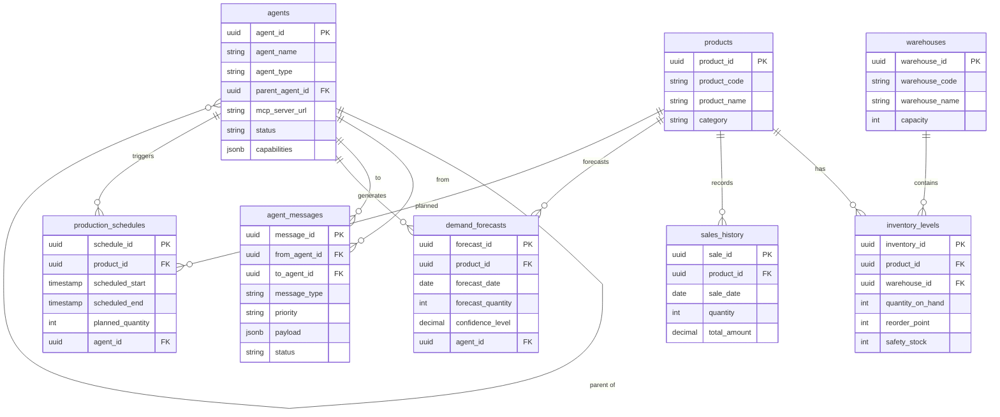

[← Back to Project Overview](../README.md)

# Database Design

The S&OP Agent Orchestrator uses a PostgreSQL database to maintain the agent registry, message history, and core supply chain data.

## Schema Overview

The database is structured into three main areas:
1. **Agent Orchestration**: Managing agents and their communication.
2. **Supply Chain Master Data**: Products and warehouses.
3. **Planning & Operations Data**: Inventory levels, sales history, demand forecasts, and production schedules.

## 1. Agent Orchestration Tables

### `agents`
Stores the central registry of all agents in the system.
- `agent_id` (UUID, PK): Unique identifier.
- `agent_name` (VARCHAR): Unique name for the agent (e.g., 'sales-agent').
- `agent_type` (VARCHAR): The role of the agent (`parent`, `sub-agent`, `reporting`).
- `parent_agent_id` (UUID, FK): Optional link to a parent agent for hierarchical orchestration.
- `mcp_server_url` (VARCHAR): The endpoint for the agent's MCP server.
- `capabilities` (JSONB): Structured data describing what the agent can do.
- `status` (VARCHAR): Current operational status.

### `agent_messages`
Logs all communication between agents routed through the Hub.
- `message_id` (UUID, PK): Unique identifier.
- `from_agent_id` (UUID, FK): Originating agent.
- `to_agent_id` (UUID, FK): Recipient agent.
- `message_type` (VARCHAR): `request`, `response`, `event`, or `broadcast`.
- `payload` (JSONB): The actual message content.
- `status` (VARCHAR): Delivery status (`pending`, `delivered`, etc.).

## 2. Supply Chain Master Data

### `products`
The catalog of items being managed.
- `product_code` (VARCHAR): Unique SKU identifier.
- `product_name` (VARCHAR): Descriptive name.
- `category` (VARCHAR): Product group (e.g., Core Components, Accessories).

### `warehouses`
Storage locations in the supply chain network.
- `warehouse_code` (VARCHAR): Unique location code.
- `warehouse_name` (VARCHAR): Descriptive name.
- `capacity` (INTEGER): Maximum storage volume.

## 3. Planning & Operations Data

### `inventory_levels`
Real-time stock status across the network.
- `product_id`, `warehouse_id` (FKs): Composite unique key.
- `quantity_on_hand` (INTEGER): Physical stock.
- `reorder_point` (INTEGER): Threshold for replenishment.
- `safety_stock` (INTEGER): Buffer stock for demand variability.

### `sales_history`
Historical transactional data used for demand forecasting.
- `sale_date` (DATE): When the sale occurred.
- `quantity` (INTEGER): Units sold.
- `region`, `channel` (VARCHAR): Market segments.

### `demand_forecasts`
Output from forecasting agents.
- `forecast_date` (DATE): Target period for the forecast.
- `forecast_quantity` (INTEGER): Projected units.
- `confidence_level` (DECIMAL): Statistical certainty of the forecast.
- `agent_id` (UUID, FK): The agent that generated the forecast.

### `production_schedules`
Aligned manufacturing plans.
- `scheduled_start`, `scheduled_end` (TIMESTAMP): Time window.
- `planned_quantity` (INTEGER): Target output.
- `agent_id` (UUID, FK): The inventory or planning agent that requested the schedule.

## Relationship Diagram

